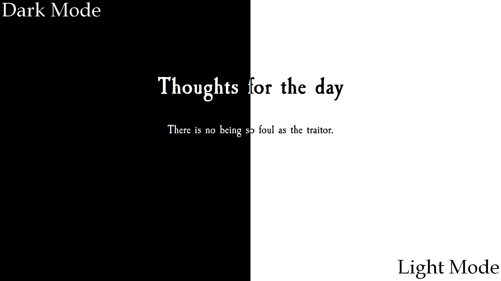

# Thoughts for the day

## *In The Grim Darkness of the Far Future There is Only War*

This is my **first** project in React.  
After hosted my app you will see:



## Simplest way to host

On the first you have to build project with:

```bash
npm install
npm run build
```

Next install globally [serve](https://github.com/vercel/serve)

```bash
npm install --global serve
```

and just serve:

```bash
 serve -s build -l <address>
```

For example:

```bash
 serve -s build -l tcp://0.0.0.0:4000
```
