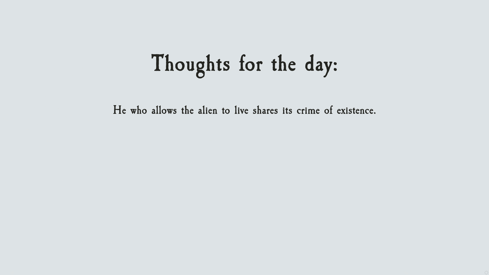

# Thoughts for today

_In the grim darkness of the far future there is only war._

This is my first project in React.



## How to use

1. Install the dependencies
   ```bash
   npm install
   ```
2. Build the project
   ```bash
   npm run build
   ```
3. Host the application
   ```bash
   npm run start
   ```

## Details

### Thoughts

Each thought has a different length, so each thought has its own time to read. It is dynamically calculated for each text.

### Page mode

In the lower right corner of the window there is a small icon.  
It is a toggle button with three states:

1. Circle - highlight mode
2. Half-filled circle - automatic mode
3. Filled circle - dark mode
